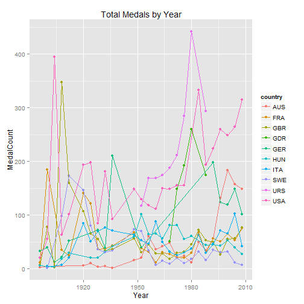
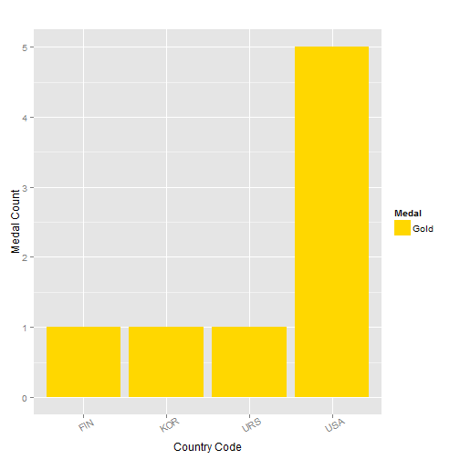

For the Gold
========================================================
author: Coursera Student
font-family:'Palatino Linotype'

History
========================================================
In 1896, 241 athletes from 14 countries got together in Athens.  They competed in a number of events to celebrate athletic achievement and to come together in harmony among the nations.  They modeled this loosely after the ancient Greek athletic festivals held in Olympia, and named this new event after the ancient Olympic games. 

Since then, every four summers, the world has come together to continue in that tradition.  99% of the focus is about amazing athletic achievement, celebrations across borders, and unity.  The other 1% is about which country will come home with the most hardware.  This app is about that 1%.

Top Overall Medal Winners
========================================================

Over all time, these are the top medal winners

```
   country MedalCount
1      USA       4335
2      URS       2049
3      GBR       1594
4      FRA       1314
5      ITA       1228
6      GER       1211
7      AUS       1075
8      HUN       1053
9      SWE       1021
10     GDR        825
```

Historical Medal Counts
========================================================
In graphic form, this is how those teams have done through the years.

 

But that's a confusing graph and it definitely doesn't show anything about specific sports or even specific metals.

Summary
========================================================
Our app allows for targeted graphs. By allowing users to choose the time period, the sport, and the medal, they get the information they are looking for.  For example, if you were targeting gold medal archers between 1972 and 1984, this app hits this bullseye.


 
